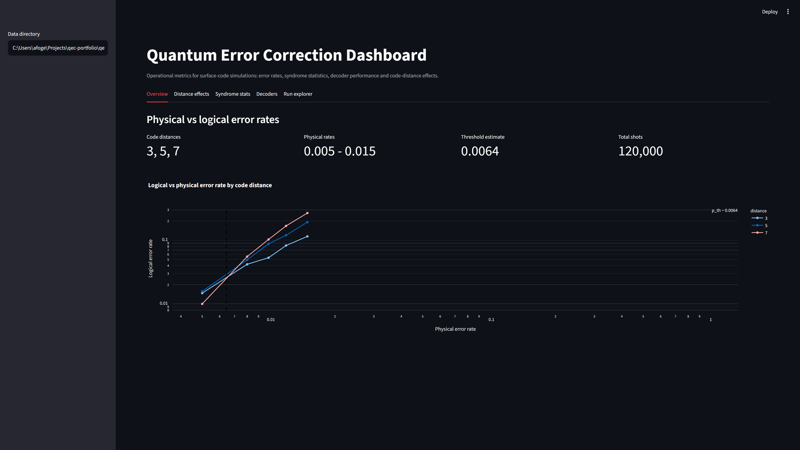

# QEC Dashboard

An operational dashboard for quantum error correction simulations, built with Streamlit. It reads
metric artifacts emitted by the upstream simulation and benchmark jobs and presents the numbers an
error-correction operations team would actually watch:

- **Physical vs logical error rates** by code distance, with the threshold marked.
- **Code distance effects** — logical error rate vs distance at a chosen physical rate.
- **Syndrome statistics** — per-detector firing frequencies.
- **Decoder performance** — leaderboard and accuracy/runtime trade-off.
- **Run explorer** — filter and export the raw run records.

This is repo 3 of a seven-part [QEC research portfolio](https://github.com/afogelis/qec-portfolio). It is intentionally
decoupled from the simulators: it consumes JSON artifacts produced by
[`surface-code-simulator`](https://github.com/afogelis/surface-code-simulator) and
[`decoder-benchmark`](https://github.com/afogelis/decoder-benchmark), the same way a production
observability stack reads metrics emitted by upstream pipelines rather than recomputing them.

## Screenshot



*Overview tab running on the bundled sample data: summary metrics and the logical-vs-physical error-rate curves by code distance, with the estimated threshold marked.*

## What this demonstrates

- **Operational metrics / observability:** turning raw simulation output into decision-ready views, the same skillset behind market-surveillance and operational dashboards — only the data now comes from quantum simulations.
- **Clean data contracts:** the dashboard depends only on JSON schemas, not on the heavy simulation stack, so it stays fast and easy to deploy.

## Install and run

```bash
pip install -e ".[dev]"
streamlit run app.py
```

The dashboard loads bundled sample data from `data/sample_runs/` out of the box, so it works with
no simulations to run. Point the sidebar at any other directory of artifacts to view your own runs.

## Regenerating the data

To refresh the bundled artifacts from the upstream repos:

```bash
pip install -e ".[generate]"   # pulls in the simulator + benchmark
qecdash-data --shots 20000
```

This writes `threshold.json`, `benchmark.json` and `syndrome.json` into `data/sample_runs/`.

## Artifact schemas

| File | Producer | Shape |
|------|----------|-------|
| `threshold.json` | `surfacecode sweep --output` | `{points: [{distance, p, logical_error_rate, ci_low, ci_high, num_shots, num_failures}], threshold_estimate}` |
| `benchmark.json` | `decbench run --output` / `mldecoder compare --output` | `{records: [{decoder, distance, p, logical_error_rate, microseconds_per_shot, peak_kib, ...}]}` |
| `syndrome.json` | `qecdash-data` | `{entries: [{distance, p, rounds, num_detectors, mean_firing, density: [...]}]}` |

## Layout

- `app.py` — Streamlit entry point (five tabs)
- `src/qecdash/data_loader.py` — artifact loaders returning pandas frames
- `src/qecdash/sample_data.py` — regenerate bundled artifacts
- `data/sample_runs/` — committed sample artifacts
- `tests/` — loader tests

## License

MIT — see [LICENSE](LICENSE).
